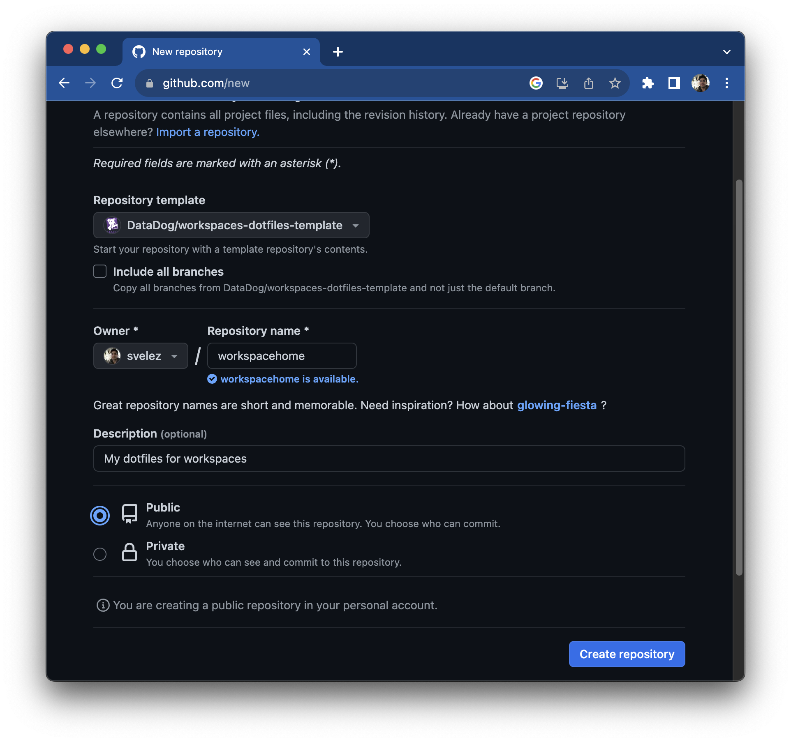

# Example dotfiles repo for initializing workspaces

This repository is supposed to be used as a template for dotfiles you
would like to have added to each new workspace that is created.  To use
it, first you must create a new personal repository with this specified
as a template. Go to http://github.com/new and initialize the repo as
follows

Alternatively, [this link](https://github.com/new?owner=@me&template_name=workspaces-dotfiles-template&template_owner=DataDog&name=dotfiles&visibility=public&description=Home+directory+initialization+for+workspaces)
will pre-fill the form with valid values.

Once `Create repository` has been selected, clone the new repository locally, modify
it as appropriate following comments in the provided files. At the very least,
replace text within `<Angle Brackets>` with values more appropriate to you.
Commit the changes, push and supply the url of the repository to the `--dotfiles`
parameter the next time you create a workspace.  This can also be persisted in the
workspaces configuration file.

See [Getting Started with Workspaces Personalization](https://datadoghq.atlassian.net/wiki/spaces/DEVX/pages/3068528729/Getting+Started+with+Workspaces+Personalization)
for details.
